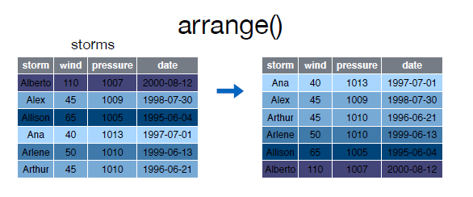
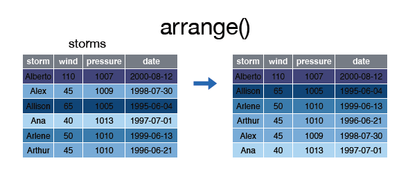
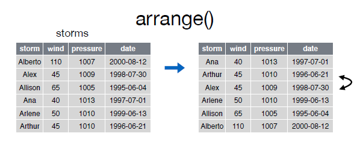

# arrange()

La función __arrange()__ se utiliza para ordenar las filas de un data frame de acuerdo a una o varias columnas/variables.  


Por defecto __arrange()__ ordena las filas por orden ascendente:  

  

Echemos un vistazo al data frame __arrange__:


```r
> library(EDAWR)
+ library(dplyr)
+ storms
+ )
```

```
Error: <text>:4:1: unexpected ')'
3: storms
4: )
   ^
```

Para ordenar las filas por la variable __wind__ de forma ascendente podemos hacer lo siguiente:  


```r
> arrange(storms, wind
```

```
Error: <text>:3:0: unexpected end of input
1: arrange(storms, wind
2: 
  ^
```

  
Si las queremos ordenar de forma ascendente lo haremos del siguiente modo:  

  


```r
> arrange(storms, desc(wind))
```

```
Error in eval(expr, envir, enclos): could not find function "arrange"
```


Podemos ordenar las filas según varias variables:  

  


```r
> storms
```

```
Error in eval(expr, envir, enclos): object 'storms' not found
```

```r
> arrange(storms, wind, date)
```

```
Error in eval(expr, envir, enclos): could not find function "arrange"
```

