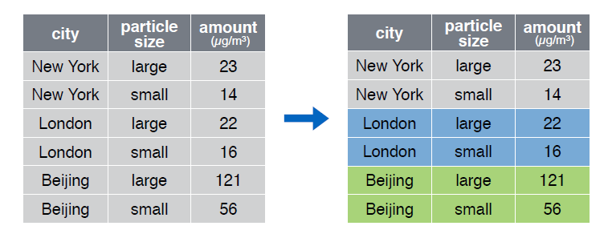
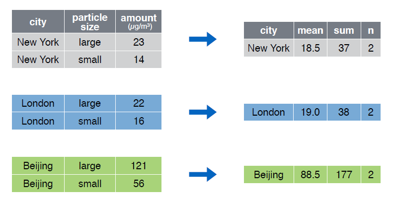

# group_by()

La función __group_by()__  agrupa un conjunto de filas seleccionado en un conjunto de filas de resumen de acuerdo con los valores de una o más columnas o expresiones.

  

Echemos un vistazo al data frame __pollution__:


```r
> pollution
```

```
      city  size amount
1 New York large     23
2 New York small     14
3   London large     22
4   London small     16
5  Beijing large    121
6  Beijing small     56
```

Agrupemos las observaciones por la variable city:  


```r
> group_by(pollution, city)
```

```
Source: local data frame [6 x 3]
Groups: city [3]

      city  size amount
     (chr) (chr)  (dbl)
1 New York large     23
2 New York small     14
3   London large     22
4   London small     16
5  Beijing large    121
6  Beijing small     56
```
  
  


La función __group_by()__ es extremadamente útil trabajando en conjunción con la función __summarise()__:  


  


```r
> pollution %>%  group_by(city) %>% 
+   summarise(mean = mean(amount), sum = sum(amount), n = n())
```

```
Source: local data frame [3 x 4]

      city  mean   sum     n
     (chr) (dbl) (dbl) (int)
1  Beijing  88.5   177     2
2   London  19.0    38     2
3 New York  18.5    37     2
```

