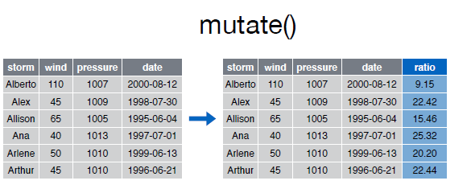
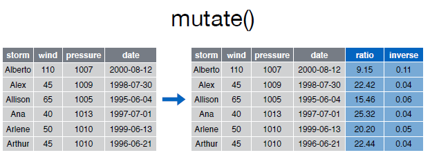

```{r knitsetup, echo=FALSE, results='hide', warning=FALSE, message=FALSE, cache=FALSE}
opts_knit$set(base.dir='./', fig.path='', out.format='md')
opts_chunk$set(prompt=TRUE, comment='', results='markup')
# See yihui.name/knitr/options for more Knitr options.
##### Put other setup R code here


# end setup chunk
```
# mutate()

Con la función __mutate()__ podemos computar tranformaciones de variables en un data frame. A menudo, tendremos la necesidad de crear nuevas variables que se calculan a partir de variables existentes,__mutate()__ nos proporciona una interface clara para realizar este tipo de operaciones.  


Así por ejemplo si deseamos calcular el ratio entre _pressure_ y _wind_:  
  


```{r}
storms
mutate(storms, ratio = pressure/wind)

```  


La función __mutate()__ nos permite encadenar varias expresiones en una misma sentencia: 

  


```{r}
mutate(storms, ratio=pressure/wind, inverse=ratio^-1)

```  


Podemos utilizar funciones de otros paquetes como resultado de una nueva columna/variable, así por ejemplo si queremos calcular la _distribución de frecuencias absolutas acumuladas_ de la variable _wind_ podríamos utilizar la función _cumsum()_ del paquete _bas_:  


```{r}
mutate(storms, freq.acumulative = cumsum(wind))

```  


