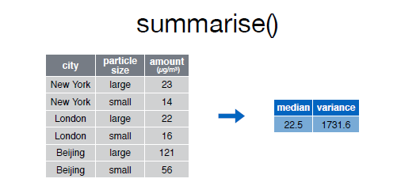
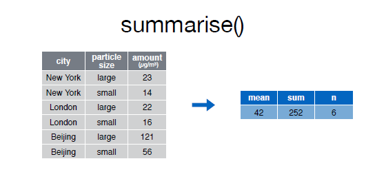

##  Summarise

La función __summarise()__ funciona de forma análoga a la función [mutate](mutate.md), excepto que en lugar de añadir nuevas columnas crea un nuevo data frame.  


Así por ejemplo, ara calcular la mediana y la varianza de la variable _amount_ en el conjunto de datos _pollution_:  

  

Echemos un vistazo al data frame __pollution__:  


```r
pollution
```

```
##       city  size amount
## 1 New York large     23
## 2 New York small     14
## 3   London large     22
## 4   London small     16
## 5  Beijing large    121
## 6  Beijing small     56
```

Para obtener un resumen con la mediana y la varianza de la variable __amount__ podemos hacer lo siguiente:  


```r
summarise(pollution, mediana = median(amount), variance = var(amount))
```

```
##   mediana variance
## 1    22.5   1731.6
```


Podemos utilizar el operador %>%, 

  


```r
pollution %>% summarise(mediana = median(amount), variance = var(amount))
```

```
##   mediana variance
## 1    22.5   1731.6
```

Obsérvese que las dos formas de hacerlo devuelven el mismo resultado.  


A continuación se muestran funciones que trabajando conjuntamente con la función __summarise()__ facilitarán nuestro trabajo diario. Las primeras pertenecen al paquete base y las otras son del paquete dplyr. Todas ellas toman como argumento un vector y devuelven un único resultado.  

  
  

|    | base |
| :---: | :---: |
| min(), max() | Valores max y min |
| mean() | media   |
| median()| mediana |
| sum() | suma de los valores  |
| var, sd()  | varianza y desviación típica |  


---
  

|      | dplyr |
| first() | primer valor en un vector |
| last() | el último valor en un vector |
| n() | el número de valores en un vector |
| n_distinct() | el número de valores distintos en un vector |
| nth() | Extrar el valor que ocupa la posición _n_ en un vector |  


